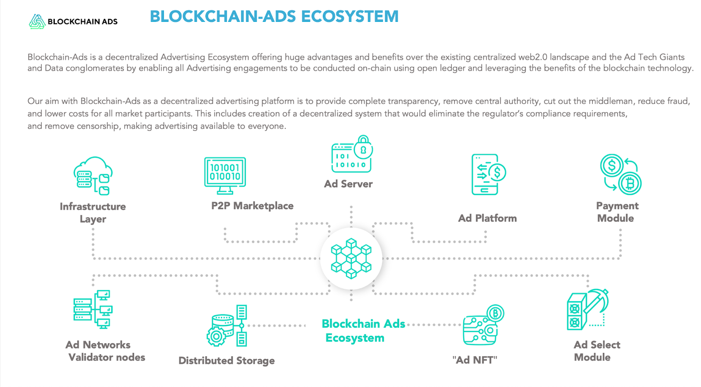

# Blockchain-Ads Whitepaper

**BLOCKCHAIN-ADS WHITEPAPER**

### **Abstract** 

Web 3.0 is the next generation of the internet, which aims to provide a decentralized and more secure network. One of the major applications of Web 3.0 is advertising technology (AdTech) and Marketing Tech (MarTech), which is currently monopolized by a few tech giants. The use of blockchain technology, zero-knowledge proofs for data validation, and a peer-to-peer (P2P) marketplace without middlemen creates more efficient and transparent environment. When combined with AI and machine learning, this can lead to a disruption of the current market monopoly.

Blockchain-Ads is addressing these issues, as the web3 generation of advertising technology and big data, leveraging blockchain technology, zero-knowledge proofs, and peer-to-peer marketplaces to create a more efficient, transparent, and privacy-preserving ecosystem.

Blockchain-ads is providing the infrastructure that enable all participants in the AdTech and BigData to transition to more efficient web3 generation of digital advertising.&#x20;

In summary a layer 3 that provide immutability and privacy at the same time while validating all data points and transaction from all participants on a consensus level.&#x20;

The Blockchain-Ads EcoSystem use few key technology advancements: &#x20;

* The Blockchain-Ads EcoSystem leverages **blockchain technology** to create a transparent, secure, and more efficient advertising ecosystem. Instead of relying on a few large advertising networks and intermediaries, web3 advertising is built on a peer-to-peer marketplace that allows advertisers to directly connect with publishers and users. The EcoSystem uses blockchain tech in two instances, for data validation and for payment.&#x20;
*   One of the critical features of web3 advertising technology is **web3 data attribution**. Blockchain-Ads proprietary tech enable full 360 attribution, meaning that it can track user behavior across multiple platforms and touch points. This can be achieved through the use of the proprietary "web3cookie", which allow user data to securely and anonymously be used to build out profiles. (off-chain and on-chain)

    This provides a much more comprehensive and accurate view of user behavior, which can lead to more effective targeting and better user experiences. This ledger tracks the origin of data, who owns it, and how it is used.&#x20;
* **"Web3cookies"** are another essential component of the web3 advertising ecosystem. Web3 cookies are an extension of standard web3 cookies that add an extra layer of web3 properties. This layer provides complete user privacy while still allowing for 360-degree attribution. Unlike traditional cookies, which are stored on centralized servers and are vulnerable to data breaches, web3 cookies are stored on a decentralized blockchain network. Importantly, the web3 cookie are designed to prioritize user privacy and data security.
* The use of **zero-knowledge proofs** (ZKP) is another critical aspect of the web3 advertising ecosystem. ZKP is a cryptographic protocol that allows for the validation of data without revealing the data itself. This ensures that user data is protected while still allowing for the efficient and accurate attribution of advertising data. ZKP allows all participants within the advertising ecosystem that protects user privacy and data.
* **Artificial Intelligence and Machine Learning** are also key components of the web3 advertising ecosystem. AI and Machine Learning enable advertisers to create more personalized and targeted advertising campaigns that are based on user behavior and preferences. By training an AI model that can communicate with the data from the P2P marketplace there is complete redundancy of central authority privacy disruptions .This improves the overall efficiency and effectiveness of advertising, while also reducing the amount of data that needs to be collected.

The Blockchain-Ads is designed to be an ergonomic, simple and effective advertising EcoSystem combining the principles of Decentralization with digital advertising.

_**This project has two stages of its business growth and market share.**_

**First,** enter and capture the web3 advertising industry as a dominant player. As part of the core value, is to provide marketers in the space to reach people based on the:

* token they hold
* chain they interact with
* their onchain behaviour
* specific wallet they use

At the same time providing full insights on Marketing efforts attribution and giving brands [insights on what marketing channels and sources are most effective](https://blockchain-ads.com/analytics.html) and calculate their ROI.

**Second,** the growth will expand from serving web3 and crypto industry to the rest of the advertising regulated industries, such as online [gambling and betting](https://www.playusa.com/research-firm-us-online-gambling-advertising-spending/), CBD, [adult](https://www.statista.com/statistics/1101065/match-group-ad-cost/) and [tobacco](https://www.statista.com/statistics/470438/cigarettes-industry-ad-spend-usa/), alcohol...etc. This is almost 8% of the [$750](https://www.statista.com/topics/990/global-advertising-market/#topicOverview)[^1][Billion advertising industry.](https://www.statista.com/topics/990/global-advertising-market/#topicOverview)

The core values it's providing in those industries are:

* Increased performance and reduced cost per Acquisition
* No restrictions in advertising&#x20;
* Completely removing ad-fraud and click-bots&#x20;
* Absolute privacy for their users&#x20;

\_\_\_\_\_\_\_\_\_\_\_\_\_\_

This paper will continue on the assumption that the reader possesses a basic understanding of blockchain technology and the advertising ecosystem.

### **1. Problems In Advertising we are solving** 

### **1.1 User Privacy &  Transparency** 

As the most obvious example, The most popular and widely used advertising solutions; Google, Facebook consistently made it incredibly difficult for blockchain companies to raise funds, sell their products and innovate. This is because they've consistently been blocking, banning and confounding advertisers in the blockchain industry for several years. This presents a significant obstacle and limiting factor for the growth of blockchain companies as a whole.

The [$5 billion **penalty** against **Facebook**](https://www.ftc.gov/news-events/news/press-releases/2019/07/ftc-imposes-5-billion-penalty-sweeping-new-privacy-restrictions-facebook) is the largest ever imposed on any company for violating consumers' privacy. And there are many more other examples. All of the power and financial benefits within these giant AdTech companies comes from the data they have on the users. The phrase, “whoever owns the information (data) owns the world”, absolutely applies in the advertising world. We can say that The big tech companies are making billions of dollars by owning our data. A concept will completely change with the introduction of the blockchain technology and the decentralized application.

Most advertising platforms get their traffic by offering a revenue share arrangement with content providers and publishers, platforms must focus on serving two customers; advertisers and publishers. This presents advertising networks with a conflict of interest; their profits are contingent upon revenue sharing with their publishers, so there is pressure to sell as much of the publisher's content for the highest price to the advertiser as possible, often compromising on traffic quality.

Not all traffic is of equal value, the vast majority of internet traffic isn't suitable for driving advertising conversions, however, because platforms rely on these content providers sharing their revenue to drive their own profits, traffic is often sold and packaged together from multiple publishers. This dilutes traffic quality and ROAS for the advertisers and drives up cost of acquisition.

### **1.2 Centralization and Censorship** 

The current advertising web2.0 industry is massively centralized. Few big companies own 90% of the market. All the participants in the ecosystem, advertisers, publishers and users depend on the big tech companies. Only Google and Facebook own 70% of the $400bn industry. Just because they own the data.

Massive restrictions and censorship are in place and the regulations are being determined by a group of people, even sometimes by one single person.

As the most obvious example, The most popular and widely used advertising solutions; Google, Facebook consistently made it incredibly difficult for blockchain companies to raise funds, sell their products and innovate. This is because they've consistently been blocking, banning and confounding advertisers in the blockchain industry for several years. This presents a significant obstacle and limiting factor for the growth of blockchain companies as a whole.

### **1.3 Banking & Identity Requirements** 

Furthermore, to advertise your business using one of the big tech platforms, a bank account and some form of identity documents are usually required. This bars many people in the developing world from using these platforms. In addition, the use of fiat currency and banks is required to fund an account. This requires the user to have a bank account and use the legacy financial system to participate in online advertising.

Furthermore, they are obliged to report and pay tax on what they have earned from using those advertising platforms.

### **1.4 High Fees, Low-Value** 

Advertising platforms are notorious for charging extremely high fees and commissions. These platform fees range from 25 - 60% in most cases.

In addition, these commissions often are compounded and multiplied when the inventory goes through multiple advertising platforms, with each platform taking a cut at each stage of the auction process. Up to 70% of ad dollars end up in the hands of the platforms, ad-exchanges and middle-men in commissions leaving only 30% for content providers. Lots of value ends up lost to intermediates as opposed to being spent on content. Lowering ROAS for advertisers.

This results in a lot of problems for the ad business. Because so many ad dollars go towards ad-tech intermediaries, a lot of value is lost for both the paying advertiser and the supply side publishers, ROI is diluted substantially as a consequence.

What makes this problem particularly challenging is that the value offered by middlemen and intermediaries is often low, this creates an atmosphere of mistrust, fraud and bad-faith in the industry.

### **2. Solutions - Web3.0 Advertising and Marketing Ecosystem** 

**Blockchain-Ads EcoSystem**

**Value proposition**

Blockchain-Ads is a Web3 Generation in AdTech & MarTech, offering decentralized infrastructure, where native web3 AdTech applications and transitioning web2 solutions can benefit from. Providing the blockchain immutability and trust, using ZK solution for scalability all of the events are validated on-chain with minimum cost and with absolute privacy for all EcoSystem participants.&#x20;

Blockchain-Ads has 3 products that are proprietary solutions and cover all the elements from the AdTech industry.

1. Advertising Platform
2. Data Marketplace&#x20;
3. Attribution/Analytics tool&#x20;

In addition the on-chain validation can be used by the existing web2 adtech solutions through a API or SDK, in order to enable complete privacy and immutability and stay compliant with the ongoing privacy protection legislation.&#x20;

<figure><figcaption></figcaption></figure>

Blockchain-Ads provide complete transparency, remove central authority, cut out the middleman, reduce fraud, and lower costs for all market participants. Blockchain-Ads its a browser agnostic solution that is based on using blockchain tech to remove all the middle man and introduce AI model for advance performance by asses users on-chain and off-chain behavior patterns;&#x20;

The solutions that Blockchain-Ads is suggesting:

### **2.1 Advertising Platform**&#x20;

In summary Blockchain-Ads P2P Ad platform is based on the following model of marketplace; every advertiser creates an account on blockchain and associates it with their domain.

An advertiser uses Blockchain-Ads APIi to describe the inventory which he wishes to advertise. A typical entry will include creative content (banner, text, video), various information about the intended audience and, of course, price. It is up to the advertiser to decide which information is made public and which is to remain a secret.

Publishers use blockchain to discover advertisers and crawl their inventories. When a user visits the publisher’s site, the inventory is analyzed to find the banner with the highest expected payout. Before displaying the banner to a user, a script checks if the banner is exactly the same as the one promised in the inventory.

Advertisers have an incentive to pay a fair amount for displaying their ads or risk getting banned from the most valuable sites, or even lose bids to other advertisers. Publishers are incentivized to display the most matching ads to maximize their yield.

#### 2.3.1 Ad Server 

The Blockchain-Ads protocol builds on top of blockchain tech to facilitate the parts that need achieving consensus in a trust-less, decentralized manner. This part is commonly referred to as the "Blockchain-Ads Server".

The Server has to implement everything related to moving funds between advertisers and publishers. To be more precise, it provides an implementation of DREW channels (unidirectional payment channel), and every advertiser's campaign maps to one DREW channel with a certain deposit.

>)

The channel is created with the following information:

* deposit: total monetary deposit; this is denoted in tokenAddr and tokenAmount;
* validUntil: the date until this channel is valid; this is also the period within the publishers can withdraw, so it should be longer than the actual specified campaign length (e.g. 3x longer);
* validators: an array of all the validators who are responsible for signing a new state; one of them should represent the advertiser, and the other - the publisher(s);
* spec: describes all the campaign criteria: e.g. buy as many impressions as possible, the maximum price they're willing to pay for impressions, and campaign duration; this is stored as arbitrary bytes (32); in the platform, we encode the criteria directly in there, but it can be used to reference a JSON descriptor stored on IPFS.

The  implementation of this component is called Blockchain-Ads-protocol-ads. While the current running implementation of Blockchain-Ads is built for EVM compatible chains, there is a an AdServer version in Rust deployed as well.

The on-chain interactions are:

* channelOpen(channel): open an DREW channel;
* channelWithdraw(state, signatures, merkleProof, amount): allows anyone who earned from this channel to withdraw their earnings by providing (state, signatures) and merkleProof;
* channelExpiredWithdraw(channel): allows the channel creator to withdraw the remaining deposit in a channel after it expires; not needed on blockchain platforms where we can define our own "end block" function, like Polygon/Polkadot.

For more information on how the payment channels work, see DREW.

#### 2.3.2 Ad Marketplace 

The market is a RESTful service maintained and hosted by Blockchain-Ads Network.

The primary role of the market is to facilitate demand/supply discovery and trading. It keeps record of all campaigns that are currently valid, and allows publishers/advertisers to query that list in order to find what they need.

The market needs to track all on-chain DREW channels and needs to constantly monitor their liveness (>=2/3 validators online and producing new states) and state.

Additional privacy can be achieved by having groups of publishers/advertisers run their own instances of the market - that way, campaigns will be visible only within their private group.

The market is currently implemented in the Blockchain-Ads-market repository. Because of its aggregation-only role, it can be considered a back-end to the Platform.

#### **2.3.2.1 Header Bidding Technology**

[Header bidding is very rapidly replacing RTB in the AdTech industry.](https://epom.com/blog/ad-server/waterfall-vs-header-bidding) Header bidding is the process of pulling all the bids in the browser, evaluating them and then sending the preferred bids to the ad exchange. In Blockchain-Ads, there is no classic ad exchange, but what we do is even more convenient: we pull all information about demand (campaigns, bids) in the browser, and directly select the bid depending on what we know about the user, therefore implementing targeting without revealing the user's profile.

In other words, in Blockchain-Ads, advertisers can bid for an impression in real-time, but we do not implement traditional real-time bidding.

Real-time bidding (RTB) is something we intentionally left out of the protocol, primarily because it relies on some details about the user being propagated around the network to the exchange.

From a scalability perspective, real-time bidding can be implemented using off-chain scaling solutions, however the privacy trade-off is too big.

**2.3.2.2 Campaign Details**

In the Marketplace, each DREW channel has its own spec, which is an arbitrary blob of bytes designed to contain any additional information for this channel.

In the Blockchain-Ads Protocol, we use that field for a specification of the advertising campaign, by referencing a JSON blob of the campaignSpec format.

To do that, we set the spec value to a 32-byte IPFS hash of the JSON blob, using the SHA2-256 digest function.

If you're a dApp builder, it is recommended that you pin this file on your own IPFS nodes. However, this file will also be permanently stored by the Marketplace when it's uploaded to it.

For the JSON blob specification, see campaignSpec. It includes a detailed description of the campaign, including min/max impression prices, targeting, ad units etc.; currently, the format is specific to Blockchain-Ads, but AdCOM might be incorporated in the future.

9Paying by impression (CPM) or by click (CPC)

It's possible to pay for advertising in any way by configuring a campaign goal - e.g. by impression, by click, or even by number of user registrations (CPA).

However, the default option is always impressions as we believe that this creates the best incentives. Paying by click implies more risk and unpredictability, since the publishers will be pushing impressions out without prior knowledge of how much a certain ad will convert.

Ultimately, the raw resource the publisher provides is impressions, and the conversion rate of the ad depends mostly on the advertiser.

**2.3.2.3 Reporting and analytics**

The validators of a DREW channel are usually two instances of the validator stack: one represents the advertiser, and the other represents multiple publishers.

This means they receive all the data related to this DREW channel, therefore allowing them to aggregate it into useful reports.

This architecture ensures that both parties get their analytical reports by aggregating the data directly from the users, which ensures reporting transparency.

In order to maintain compatibility with the existing Blockchain-Ads infrastructure (the Platform and the Server), you don't need to follow the architecture outlined in validator-stack., but you need to implement the same RESTful APIs.

#### 2.3.3 Self-service Platform 

The primary implementation is Blockchain-Ads-Server-manager, which is designed for the web. It's important to note that the Platform is entirely browser-agnostic. It can run as a library (alongside React or any other modern framework) or in an \<iframe> on the publisher's webpage.

The Platform is responsible for:

1. Pulling all possible demand (campaigns, bids) from the Blockchain-Ads Marketplace;
2. Picking which ad to show depending on the user: this depends on a combination of price and targeting (header bidding and contextual targeting);
3. Generating events (impressions, clicks) and sending them to all validators and observers of the given ad;

#### &#x20;    **2.3.3.1 Contextual targeting**

Notice a common pattern here: sensitive information never leaves the user's browser, and this is achieved by shifting the process of targeting (selecting ads) to the browser itself. To achieve this, we use contextual targeting.

This works by relying on publishers to feed what they know about the context (e.g. "this page is about bicycles") and potentially the user (e.g. "this user is female") directly into the Server API. The incentive for this is built-in: better targeted ads mean higher revenues.

This system is based on tags, which are not specified in the Blockchain-Ads protocol itself and are entirely defined by network participants. They could describe anything - interests, demographics, geographics, etc.

&#x20;  **2.3.3.2 Behavioral targeting**

Because contextual targeting has certain limitations (e.g. no remarketing), there is a possibility to introduce behavioral targeting. This will not compromise privacy, because the data collected is not exposed to any third parties.

To achieve this, the Server always has to be loaded from the same domain (e.g. Blockchain-Ads.com). This can be trust-minimized in the future through ENS, IPFS or even just using checksum-based integrity checks.

Advertisers may report tags that allow for remarketing, such as a tag indicating that a user visited their website, or even a tag indicating they've visited a particular page, allowing for dynamic remarketing.

&#x20;  **2.3.3.3 Privacy of the end-user**

Privacy of end users is protected by not collecting any PII data at all, at any part of the system.

Furthermore, we have moved the process of selecting an ad to show to the user's browser, which is essentially equivalent header bidding but with stronger privacy guarantees. This ensures that user data never needs to be exposed/revealed.

A further advantage to this approach is that the user can easily control what kinds of ads they see, without this being revealed to third parties.

To ensure that infrastructure providers such as the Market and validators have no ability to collect data, Server sends no identifiable user data when interacting with them. Furthermore, each ad campaign can be handled by different validators to ensure that the validator operators cannot perform side-channel attacks. Finally, validators are required to implement the EFF's Do not track policy.

### **2.2 Private Data Management Platform (Marketplace)**

The concept of a Private Data Management Platform is a marketplace for users browsing data, a place where dataset are being stored and sold. The focus is held on privacy and immutability. The [big data industry is roughly worth $200Bn](https://www.marketsandmarkets.com/Market-Reports/big-data-market-1068.html) and massively suppressed by legislation. The whole industry is in jeopardy of collapsing. The solution is very simple. Data democratization and shared revenue model.&#x20;

The solution composes of 2 parts: data acquisition network and data management.

As the time of the writing of this whitepaper only the key component of the Data Marketplace the "Web3Cookie"

The data Acquisition happens in two ways:

* Indirect: where data is acquired through a network of 3rd party websites, online properties, apps, data partners...etc.&#x20;
* Direct: on BCA website properties where data is being collected directly from the users.&#x20;

In both cases there is a shared revenue model in place, where the data providers are compensated with 50% of the revenue generated every single time the data sets are accessed by a vendor.&#x20;

Data Management is a way to manage and segment data and data set on user profiles that are completely private. The same principal used in the Analytics is used here, where every user profile has a unique ID and it stored separately from the user data sets (browsing data) and wallet address if any.

The BCA layer is where the data is validated and verified without revealing the content of the data sets. This makes it completey privacy compliant. Further more every data provided, example have a standard consent form on their website, so the solution that BCA provide add additional security and privacy when managing and monetizing that data.&#x20;

Recently, some of the biggest web3 brands such as Metamask and Aave, started collecting users IP addresses for the purpose of monetizing that data. The Big web2 brands who are entering the space already have a massive data monetization opportunity.&#x20;

So private data aggregate is way more valuable on the vendors market than a single data provider, as those data sets can be cross-matched and cross-reference across different data providers building high quality and valuable structured data. &#x20;

BUSINESS MODEL / REVENUE STREAMS

Data Exchange:&#x20;

Device ID only: $25/month per 1,000 users. 1M users is $25,000/month.

Wallet Address + Device ID: $35 per user / month (including wallet Analytics).&#x20;

Integrated Advertising: Activating purchased data on the Blockchain-Ads ad platform + contextual advertising.

Avg. Advertising Price (CPM): $3.9. Price adjusts itself based on supply and demand.                  Avg. Contextual Price (CPM): $3.12. Price adjusts itself based on supply and demand. Those who also buy data will get priority in the auction.

With this business model and assuming the following split:

Blockchain-Ads: 50% ; Data provider: 50%

Data provider gets (on average):&#x20;

* $10,000/per vendor access to the data insights, considering the data provider have 500k of users a month.
* $10,000x100= $1,000,000 when 100 vendors (advertisers, ad networks, SSP...) access that data sets

Data provider’s revenue will be split equally between all publishers that share each piece of data, but they will earn enough money anyways as they will sell in bulk instead of individual users. For example, if you have 1,000,000 visitors, you would earn $12,500 every time an advertiser accesses that data, assuming minimum overlap with any other publishers.

On the demand side: The Private Data Management platform enable activation of 3rd party data, segmenting 1st party data and activating those segments cross-platforms. Using a Universal ID and mobile ID the data can be activated on any programmatic platforms, social platfroms, retargeting...etc. This opens up a lot of used-cases.

#### **2.2.1 Web3Cookie**

The Core proprietery solution within the BCA EcoSystem is the "Web3cookie"&#x20;

Simply put Web3 cookies are an extension of standard web3 cookies that add an extra layer of web3 properties. This layer provides complete user privacy while still allowing for 360-degree attribution. Unlike traditional cookies, which are stored on centralized servers and are vulnerable to data breaches, web3 cookies are stored on a decentralized blockchain network. This ensures that users have complete control over their data, and their privacy is protected.

Web3 cookies work by creating a unique identifier that is stored on the user's device. This identifier is then used to track user behavior across different websites and platforms. However, unlike traditional cookies, the user's data is not shared with any centralized servers or third-party advertisers.

The cookie can we deployed in two ways:

* **Passively:**&#x20;

Like any other cookie and on a website property. This gives a way to the publishers(websites) to  monetize the data,&#x20;

This distribution channel is seamless and requires zero user action, used to get high volume of data.

* **Actively:**

For users to generate their own cookie on BCA online properties. At the moment there is only a web3 signup solution, where users directly communicate with a smart contract and generate their cookie. This is a way to enable users to monetize on their own data.&#x20;

This is the distribution channel used to onboard the new 1M web3 users.&#x20;

The Web3cookie solution is used across all BCA EcoSystem products and it's the part that connects all participants.&#x20;

The web3cookie is build for privacy, so there is a always concent by the user:

\- when deployed passively, the website visitors are interecting and give consent to the brand to collect their data, after which the cookie is deployed and the data passed to the backend.&#x20;

\- when deployed actively the users give consent by communicating with the BCA smart contract directly, after which the cookie is deployed and data passed to the backend.&#x20;

In both cases it creates anonymous profiles, that have unique ID's and are stored separatelly then the data sets attached to these ID's. Using a ZK proof solution the data is verified without reaveling the content.&#x20;

The technical implementation of the cookie is in the [BCA GitRepo](https://github.com/Blockchain-Ads/Web3-cookie-SC).&#x20;

<figure><figcaption></figcaption></figure>

### **2.3 Attribution/Analytics platform**  

Considering the fact the some of the biggest Brand companies are entering the web3 space, and creating new revenue models, for example Disney or NBA, who combined grossed over 1B in revenue from their branded digital collectibles. There are more than 1000 top brands that are looking to enter this profitable business line. The biggest problem is the data insights. Crypto wallets are build for privacy and anonymity. How can marketers see what marketing sources are marketing efforts are bringing the best performance and how can they see what users want and what are they interested in.

Blockchain-Ads Attribution/Analytics script act as a merger between web2 website actions and web3 on-chain transactions. Using an NodeJS code that is deployed on a website, as same as deploying Google Analytics script, with an additional functionality that is passing the web3 properties to the backend and adding them to the standard user profile.&#x20;

This creates anonymous profiles, that have unique ID's and are stored separately then the data sets attached to these ID's. Using a ZK proof solution the data is verified without revealing the content.&#x20;

Using an indexer, the datasets are being indexed on-chain based on specific predetermined set of criteria (number of transaction, age of the wallet, activity of the user) or specific on-chain tags (DeFi, GameFi, Play2Earn, Stablecoins, ) and passed back to the front UI analytics.&#x20;

This gives detail insights and enable brands to trully know their audince and have 360 attribution. Based web2 events tracking they can determined where the users came from  (Paid/organic, or what source, social, search, ad network) and based on the on-chain transactions they can calculate their Marketing ROI and optimize the marketing efforts accordingly.&#x20;

The deployment of the analytics script is explained in the [git repo that is public](https://github.com/Blockchain-Ads/attribution-analytics#getting-started).

Business Model:

Analytics Platform (Web3): Freemium Model with limited features and amount of data on the free version. Business model will be based on hits (page views, action taken on the website etc…)

Price starts at $200 for 600,000 hits (per month) and goes up to $15,000 for 100 million hits

### **3. Benefits from the Proposed Solution**  

#### **3.1 Decentralized Advertising ecosystem** 

Advertisers and Publishers meet directly using the Blockchain-Ads P2P Network as the core which acts as a decentralized marketplace governed by the smart contracts.

All the current web2.0 middlemen are made redundant and their massively overestimated role is needless by default.

Ultimately, Blockchain-Ads is completely censorship resistant since anyone can run their own Marketplace and Platform and use it in any vertical within the Advertising & BigData Industry.

By providing a viable and effective alternative advertising solution to big tech platforms, specifically designed for the Web3.0 generation, Blockchain-Ads will play an important part in the process of freeing blockchain enterprises from the restrictions and limitations imposed upon them by censorious big tech platforms.

#### **3.2 No Middleman - No Fees Or Commissions** 

The primary goal for the Blockchain-Ads ecosystem is to render various ad exchanges obsolete by using the open platform that will enable advertisers and publishers to find themselves and trade directly using blockchain.

Standardized exchange and easy access to market will foster development of open algorithms that will enable publishers to be their own SSP and advertisers to be their own DSP.

Furthermore, Blockchain-Ads **does not** operate on a revenue-share basis with publishers, meaning no commissions will be charged on purchased traffic. That means a substantial amount of value that would usually go towards intermediaries and middle-men will instead go directly to supply side publishers and provide a significant boost in ROAS potential for advertisers.

Blockchain-Ads server will be funded directly by sales of the BCA token, which is required to access and buy advertising engagements on the Blockchain-Ads platform. This removes the need for us to charge a commission and gives us the ability to pay top dollar for the best performing traffic assets.

By offering only min transaction fee, Blockchain-Ads Server is able to pay publishers significantly more and stands to be an extremely attractive and lucrative alternative to current advertising platforms. In addition, by abolishing the revenue share / commission model, Blockchain-Ads find it much easier to negotiate with extremely high quality traffic sources and create tangible long-term value for both the supply side and demand side of the advertising ecosystem.

More information about the business model mechanics can be in the token economics section of this document.

#### **3.3 Bank - less Advertising** 

There's nothing in Blockchain-Ads requiring advertisers/publishers to identify themselves with anything other than a cryptographic identity. Blockchain-Ads is an advertising platform that will exist in an economy that is completely separate from the banking system.

The BCA token replaces the use of fiat currency and does not require a bank account, therefore, anyone with a crypto wallet can access the platform, acquire a BCA balance and use the platform regardless of their identity or banking status.

More generally, we can observe that ad exchanges operating in centralized environments have huge pricing power over their users as they can enforce certain policies and accompanying services, like ad quality standards, landing page classification or data services. The smallest users are the ones most disadvantaged in this area. With an efficient, common means of payment, most of the accompanying services can move to on-demand services, competition will greatly increase and prices will fall.

In addition, we make a commitment to enable open access, without an account, utilizing the wallet sign-in mechanism to identify and manage user accounts.

#### **3.4 Transparent and Secure Platform** 

The Blockchain-Ads platform will not share revenue with publishers, instead, the Blockchain Ad Platform acts as a marketplace where publishers and advertisers communicate directly. The ad in inventories are being offered by the publishers and ad creatives to be advertised by the advertisers, The open ledger allows clear visibility which websites the ads are being shown and the ad traffic by specific zone.

This gives both parties unparalleled freedom to choose exactly what kind of traffic they provide and impressions delivered, and also eliminates the conflict of interest that arises when advertising platforms are responsible for providing monetization for their publishers.

Accounts used to receive and send payments for ads on blockchain will be linked to domains. This repository of cryptographic keys can be leveraged to authenticate events generated during ad request and delivery. This will substantially reduce surface attacks by fraudsters.

<figure><figcaption></figcaption></figure>

### 4. Advertising Industry Competition 

The current Advertising landscape can be divided in: Web2.0 & Web3.0

#### 4.1 Web2.0 - Centralized 

Big players in the ad exchange market like Google DoubleClick, Facebook, Criteo, Bing, AppNexus, OpenX, AOL’s Marketplace own more than 80% of the advertising market as we know today. However, they are not considered as Blockchain-Ads direct competitors, based on three different factors:

\- **Technology** - Blockchain-Ads use open source technology that is being supported by and belongs to the community. All of the participants in the advertising ecosystem have voting and decision-making rights.&#x20;

\- **Business model** - Disintermediation model: No middleman is required in the new web3.0 Advertising model. Just like the banks and central authorities will be redundant with the mass adoption of DeFI the same will happen with the centralized Advertising authorities.

* **Payment** - private, bankless and borderless. The current web2.0 advertisers giants have restrictions and strict rules about who can participate and which countries are eligible to advertise and offer their publishing services. Payment can be done only by identity check that contradicts the privacy policy. Blockchain-Ads ecosystem allows payment to be done on-chain completely secured, on an open ledger.

These 3 factors will shift the weight and elevate the game on a different level. Meaning that with decentralization taking place across all industries, the Advertising Industry will adapt and evolve, leaving robust, corporate Tech giants.

#### 4.2 Web3.0 Decentralized Advertising 

There are few projects that have had an attempt to make an entry in the web3.0 advertising industry: Adex.Network, BAT, Adshares.net, Alkimi.exchange ….&#x20;

All of them generally do not comply with the principles of Decentralization in a meaningful way. None of these projects have Blockchain solutions for tracking and historical data. The transactions and ad inventories are stored on a third party server, off-chain, which defy the whole decentralized value.&#x20;

And most importantly all these projects main purpose is to leverage the DeFi side of their projects and gather their community around that goal.&#x20;

The actual Advertising participants, Advertisers, Publishers and most importantly Users are not the core members of the community. The blockchain technology terminology is only used for marketing purposes and not actually used to solve the real problems.

### Appendix 

#### 1. Autonomous regulation 

Ultimately, Blockchain-Ads is completely censorship resistant since anyone can run their own Marketplace and Platform and do whatever they want with them.

However, there are plenty of situations where you need control; for example, as a publisher, you may want your website to be free of deceptive ads (malvertising).

The Blockchain-Ads components provide multiple ways for the system to self regulate:

* Publishers can whitelist or blacklist advertisers or ad units;
* Advertisers can whitelist or blacklist publishers, topics (tags) or individual ad slots;
* Users can blacklist ad units, advertisers and even topics (tags).

Further down the line, reputation systems could be developed to make it easier for participants to push out low quality or deceptive ads.

#### 2. Preventing fraud/attacks 

One of the main challenges of any digital advertising system is preventing fake or invalid impressions/clicks.

There are a few ways to mitigate that in Blockchain-Ads:

1. Traditional AdTech methods, such as IP whitelists/blacklists, as well as verifying publishers by their domain name
2. The Server has to send each event to each validator, and they will keep an internal ledger of IPs events came from and impose a limit.
3. Requiring a proof of work challenge to be solved in order to submit a click/impression message, therefore making it more expensive than the reward you'd get for the corresponding event
4. The Server allows publishers to vouch for users of their website/app, for example if a user registers on your website and verifies a valid phone number; that allows users to gain reputation as "real" users, and therefore more conservative advertisers may define in their campaigns to only target users above a certain threshold

Blockchain-Ads tries to make it as hard as possible. We believe the transparent reporting aspect of the system, combined with the "custom events", which allow you to track end results (e.g. registrations, purchases, etc.), ensure that the incentives for fraud are significantly reduced.

#### 3. Privacy of publishers/advertisers 

There's nothing in Blockchain-Ads requiring advertisers/publishers to identify themselves with anything other than a cryptographic identity (wallet address). Information that might reveal more (e.g. ad unit info, web addresses, creatives) is kept on permission based blockchain and completely decentralized data storage.

Furthermore, the full event history is distributed across validators/observers. Each validator will only collect the full event history for the channels they're validating.

In other words, sensitive and valuable data is kept private to the parties that have accumulated it, and relationships between publishers/advertisers cannot be publicly traced.

Anyone in the network can query any validators for events, but only for the events that they're involved in. For example, if you're a publisher/advertiser/user, you can query all validators to get the events related to you.

Please note that the entire balance tree of each channel will be revealed to everyone at all times, (1) to allow earners (publishers) to observe it's validity and (2) it will be revealed on-chain anyway once everyone withdraws.

#### 4. Identity 

The Identity layer is designed to streamline the user experience of the Platform.

It is a smart contract that allows the users of the Platform (publishers/advertisers) to:

* Use many devices (e.g. PC, mobile, HW wallet) as one identity, without having to share the same private key between them (essentially a multisig)&#x20;
* Allow certain actions to be scheduled/performed automatically without needing them to be online, for example withdrawing funds from DREW channels (called "sweeping" to distinguish it from actual withdrawing)

This solves many UX hurdles that are typical for blockchain-related applications.

In the Platform, we also allow the so-called "Quick accounts' ': you can sign up with an email/passphrase, and the Platform will generate and store a keypair for you, encrypted with your passphrase. Because this is suboptimal for security, those accounts may be limited (by the Market) in terms of earnings. However, thanks to the Identity layer, those accounts can be easily secured by de-authorizing the temporary keypair and authorizing a proper wallet such as Metamask/Trezor.

### 5. Growth plan 

The Blockchain-Ads EcoSystem is under active development.

Blockchain-Ads Ad Platform and Blockchain-Ads Analytics have completed MVP stage and currently are in the market fit phase. The platform is functional and currently is connected with several ad networks and publishers.

Bringing Blockchain-Ads ecosystem to full operable and scalable stage, will take 6 - 12 months depending on funding levels.

Based on the 18 months of testing the market the EcoSystem Generated more than $1.2M in revenue from 75 customers. The cost per acquisition was +$200,000.&#x20;

Cost per client acquisition includes automated lead generation infrastructure + salaries & commissions of marketing, growth, design and sales employees and contractors.

Based of that numbers this is the proposed growth plan.

1. **Expand the client base:** Assuming the company generates in average $22,000 in revenue per client with a CPA of $1,600, the EcoSystem would need to acquire around 1,818 new clients in the next 5 years to reach $40,000,000 in revenue. Given the 50% retention rate, the company would need to acquire a total of 3,636 clients over the course of the next 5 years.

* There is a structure in place that have been used by the BlockchainAds Labs team to scale a web2 AdTech solution from $10K to $550K in MRR within 3 years. It is a system that is heavily focusing on inbound marketing or product led marketing.&#x20;
* Partnership Program - Affiliate. [https://www.blockchain-ads.com/partner-program](https://www.blockchain-ads.com/partner-program)&#x20;

2. **Develop strategic partnerships**: These partnerships will help the EcoSystem reach a wider audience and establish itself as a key player in the industry. Assuming the team signs 5 strategic partnerships in the next 5 years, this could lead to an additional 473 new clients and $10,000,000 in revenue.

* Partnership will be formed mostly with the data marketplace: there is a strong demand on the market for user data, especially after the death of the cookies.&#x20;

Some example of partners:

* Small & Medium sized Data businesses who are looking for new audiences to add to their taxonomies: companies such as BDex, OnAudience, Iponweb who sell data and are always looking for the next audience to monetize. These players’ demand will be very elastic, depending on the volume of ad spend in the Web3 space. They are always looking for new sales opportunities, especially in “unexplored” verticals. However, they may be easier to approach from their customers’ side, by having advertisers refer us to them. Advertisers who are already integrating with such DMPs or DSPs will want to have our audiences onboarded through those platforms for ease of access. Once our foot is inside the door, it will be easy to scale our business with those Data companies and have them sell our audiences for us to their clients.

3. **Expand product offering:** Blockchain-ads revenue from the MVP stage is solely from the AdPlatform. Expanding the offering with the Analytics tools and the Data marketplace, the EcoSystem has the potential to generate additional revenue. What is currenlty in development is the KOL/Influencers Marketplace and a quest platfrom. All of this is currently supported by a AI Command based Center.&#x20;
4. Invest in **R\&D**: Blockchain Ads Labs team will definitely invest in research and development to stay ahead of the curve in the rapidly evolving crypto market. This could involve exploring new technologies or developing proprietary algorithms, such as AI optimization model, that improve the performance of the Ad Platform. Assuming the team invests 10% of its revenue in R\&D, this could lead to new product features and efficiencies that lead to 20% increase in revenue, or around $8,000,000 in additional revenue.
5. **Branding**: Blockchain Ads will work on developing a strong brand that is recognizable and trusted in the crypto market and other restrictive industries. This could involve a comprehensive brand strategy that includes public relations, social media and content marketing. Assuming the company invests 5% of its revenue in branding, this could lead to an additional 10% increase in revenue or around $4,000,000 in additional revenue.
6. **Expand to new markets:** Once EcoSystem has established a strong presence in the crypto market it will consider expanding into new markets. This could include other industries where privacy and compliance are important, such as gaming, gambling CBD or alcohol. The BCA is already entering the igaming industry and acquiring few brand names as customers bringing over $100k in revenue.  Assuming the company expands to two new industries in the next 5 years, this could lead to an additional 546 new clients and $12,000,000 in revenue.
7. **Focus on customer success**: Blockchain Ads will prioritize customer success by providing excellent product service and ongoing support. This will help to retain existing clients and attract new ones through positive referrals. Assuming the company maintains a client retention rate of 50%, this would lead to a retention of 1,818 clients and $40,000,000 in revenue.
8. **Maintain a data-driven approach:** Blockchain Ads will continue to use data to inform decision-making and optimize the performance of the Ad Platform. This could involve analyzing data on customer behavior, campaign performance, and market trends to identify opportunities for growth and improvement. Assuming the company uses data to improve campaign performance by 10%, this could lead to an additional $4,000,000 in revenue.

**LEGAL DISCLAIMER**

Read this notice very carefully. It is recommended that you obtain independent legal advice before engaging in any activity pertaining to this document.

Neither we nor any third-party service provider shall be liable for any form of damage or loss, direct or indirect, that may be incurred by you as a consequence of reading this , or other materials produced by Blockchain-Ads, or found via the blockchain-ads.com website.&#x20;

NO OFFERS OF SECURITIES, ADVICE OR SOLICITATION&#x20;

This whitepaper is intended for informational purposes only. It is not intended to be investment advice, solicitation of any kind, nor an endorsement. Any decisions or actions taken on the basis of information presented in this whitepaper, the Blockchain-Ads website, or other content, is done so at your own risk and discretion.

&#x20;FORWARD-LOOKING STATEMENTS&#x20;

Certain information set forth in this whitepaper includes forward-looking information regarding the future of the project, future events and projections. These statements may be identified by, but are not limited to, words and phrases such as ”will“, “estimate”, “believe”, “expect”, “project”, “anticipate”, or other words of similar meaning. Such forward-looking statements are also included in other publicly available materials such as videos, blog posts, interviews, etc.

&#x20;Information contained in this whitepaper constitutes forward-looking statements and includes, but is not limited to: the projected performance of the project completion of the campaign the expected development of the project execution of the project’s vision and strategy future liquidity, working capital, and capital requirements The forward-looking statements involve a variety of risks and uncertainties. Should any of these risks or uncertainties materialize, the actual performance and progress of the Blockchain-Ads might differ from expectations as shown in the forward-looking statements.&#x20;

These statements are not guarantees of future performance and no undue reliance should be placed on them. Blockchain-Ads undertakes no obligation to update forward-looking statements if circumstances change. By acting upon forward-looking information received from the whitepaper, Blockchain-Ads website, and other materials produced by Blockchain-Ads, you bear full responsibility in the case of forward-looking statements not materializing.&#x20;

No Guarantees There is no guarantee that the Blockchain-Ads platform will be a success. Similarly, there is no guarantee that the value of the Blockchain-Ads token will rise. You are advised to thoroughly assess the risks and uncertainties involved, before making any decisions.&#x20;

No promises in terms of token value or future performance are made.&#x20;

Exclusion of Liabilities Blockchain-Ads makes no representations or warranties whatsoever, and disclaims all liability and responsibility, to the maximum extent of the law, for any statement or informative material communicated. The Blockchain-Ads team takes all reasonable steps to ensure the integrity and accuracy of information communicated by them.

Upon taking any action after reading information presented in this whitepaper, the Blockchain-Ads website, or other content produced by Blockchain-Ads you confirm that: T

his whitepaper, the Blockchain-Ads website, or any other material produced by Blockchain-Ads, is not an offering, solicitation or prospectus of any kind.&#x20;

Blockchain-Ads is exempted from any direct or indirect liability to the maximum extent of the law. Blockchain-Ads tokens are not regarded as securities in any jurisdiction, and the Blockchain-Ads token is classified as a utility token.&#x20;

You have a good understanding of the key components of blockchain technology and understand how blockchain operates. In addition, you fully understand how to use blockchain wallets, including safeguarding private keys. You are aware of risks involved in the cryptocurrency industry and are able to bear potential losses in full.

[^1]: 
